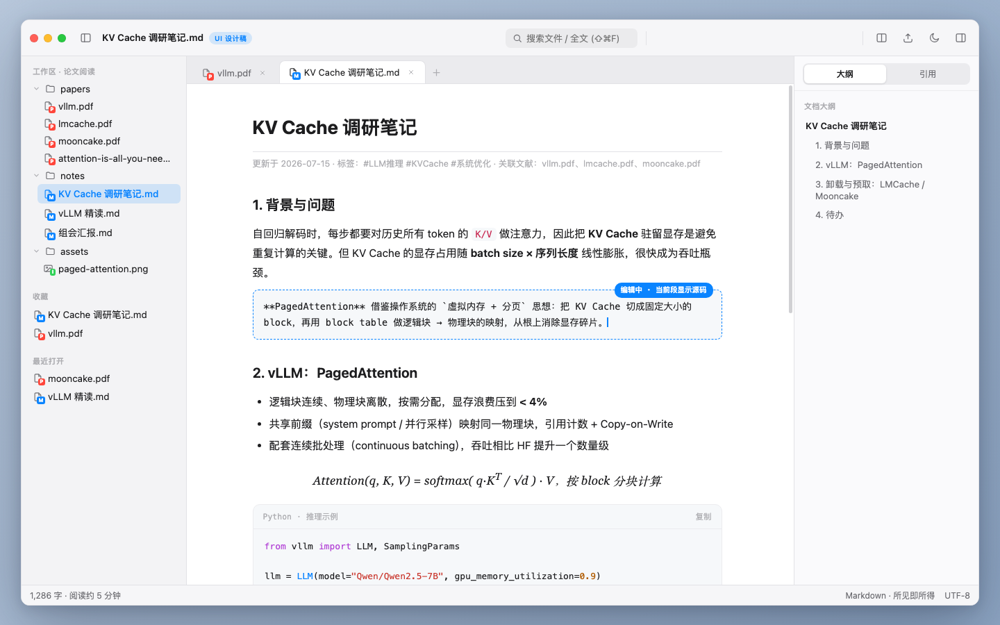

# MarkPDF Studio

**macOS 原生 Markdown + PDF 阅读编辑工作台**：在一个窗口内完成「管理文件 → 阅读并标注 PDF → 编写 Markdown 笔记 → 双向关联」的完整闭环。



[](https://github.com/whyluna/markpdf-studio/actions/workflows/macos.yml)
[](https://github.com/whyluna/markpdf-studio/releases)

## 这是什么

为「读论文/文档 + 做笔记」场景而生的轻量工作台，适合：

- **研究生 / 科研人员**：大量阅读 PDF 论文，需要高亮批注并沉淀为结构化笔记
- **开发者 / 文字工作者**：需要 Typora 级体验的 Markdown 写作工具

**文件即真相**：md 存纯文本源码、PDF 标注写回标准 PDF Annotation（系统预览可见），不使用私有数据库锁死你的数据。单机离线、无账号、无遥测。

## 功能亮点

| 模块 | 能力 |
|---|---|
| **Markdown 编辑** | 所见即所得 / 源码 / 阅读三模式 · GFM 全集 · KaTeX 公式 / 脚注 / `==高亮==` · 大纲 TOC · 图片粘贴自动存入 assets · 字数统计 · 导出 PDF（A4 分页）/ HTML · 打字机与专注模式 |
| **PDF 阅读** | 缩放 50%–400% · 大纲 / 书签 / 缩略图 · 页内搜索 · 阅读位置记忆 · 夜间主题（智能反色、图片不反色） |
| **PDF 标注** | 高亮 / 下划线 / 删除线 / 页边批注 · 四色系统 · 写回标准 PDF（自动 .bak 备份）· 只读 sidecar 模式 · 一键导出全部标注为 Markdown（按页分组 + 页码回链 + 增量去重） |
| **双向关联** | PDF 选字 ⇧⌘C 复制为带回链引用块 · md 中 ⌘+点击回链跳回 PDF 对应页 · 反向链接面板 |
| **效率** | ⌘P 快速打开 · ⌘⇧F 全文搜索（md + PDF）· ⌘O 命令面板（支持拼音首字母） · 标签页 / 左右分栏 · 收藏夹与最近打开 |

## 下载安装

- **要求**：macOS 13 Ventura 及以上（Apple Silicon / Intel）
- 在 [**Releases**](https://github.com/whyluna/markpdf-studio/releases) 下载最新 `MarkPDF-x.x.x.dmg`，把 MarkPDF.app 拖入 Applications
- **首次打开请右键点击图标 →「打开」**（当前未购买 Apple Developer ID 签名，Gatekeeper 提示「无法验证开发者」属正常现象，仅需首次操作一次）

## 快速上手

1. **⌘⇧O** 打开一个文件夹作为工作区——左侧文件树展示其中的 md / PDF / 图片（⌘O 现为命令面板入口）
2. 点 `.md` 进入编辑（三模式切换，停止输入 0.5 秒自动保存，**⌘S** 立即保存）
3. 点 `.pdf` 阅读：划词即出标注工具条，右侧栏管理缩略图 / 书签 / 标注
4. 标注完成 → 工具栏导出图标 →「导出全部标注为 Markdown」，按页分组写进笔记并带页码回链
5. 笔记里 **⌘+点击** 回链 → 跳回 PDF 对应页并闪烁；右侧「引用」面板查看反向链接

更多技巧：**⌘O** 打开命令面板，全部功能可搜索执行（支持拼音首字母，如输 `dc` 找「导出」）。

## 从源码构建

```bash
# 前置：Xcode 15+，Node.js 20+（编辑器内核构建），XcodeGen
brew install node xcodegen

git clone git@github.com:whyluna/markpdf-studio.git
cd markpdf-studio

# 构建编辑器内核（生成 dist/editor.js；首次必须先做这一步）
cd MarkPDF/Resources/Web && npm ci && npm run build && cd ../../..

# 生成 Xcode 工程（.xcodeproj 不入库，由 project.yml 生成）
xcodegen generate

open MarkPDF.xcodeproj   # Cmd+R 运行
```

测试：Swift 单元测试 `xcodebuild -scheme MarkPDF test`；编辑器内核测试 `cd MarkPDF/Resources/Web && npm test`。

## 文档

- [**功能说明**](docs/功能说明.md)：完整功能与快捷键手册（Markdown 语法、PDF 标注、联动、设置、已知限制）

## License

[MIT](LICENSE)
