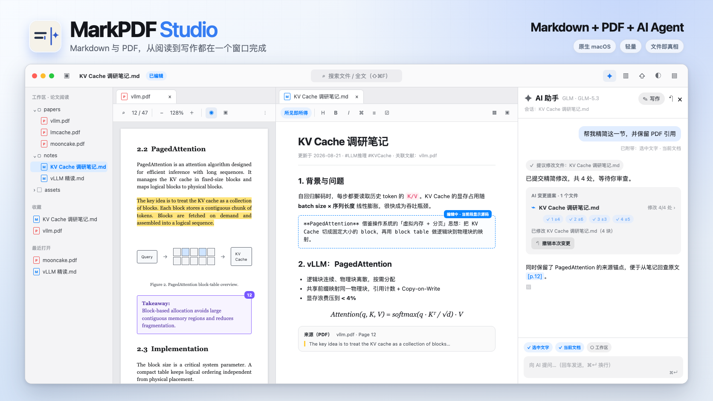

# MarkPDF Studio

**轻量的 macOS 原生 Markdown + PDF AI 工作台**：在一个窗口里阅读并标注 PDF、编写 Markdown，再由内置 Agent 辅助读文档与写笔记。



[](https://github.com/whyluna/markpdf-studio/releases)

## 这是什么

MarkPDF 把通常分散在阅读器、Markdown 编辑器和 AI 对话框里的工作，收进一个轻量原生窗口：

- **Markdown + PDF 一体**：同一工作区管理源文件，左右分栏对照，PDF 标注、页码回链和 Markdown 笔记直接连起来
- **PDF 阅读 Agent**：基于选中文字、当前文档与工作区资料检索作答，保留 `[§章节]` / `[p.页码]` 来源锚点
- **Markdown 写作 Agent**：先生成可逐段审查的文件修改提案，确认后才落盘，可查看 diff、部分接受和整批撤销
- **轻量且文件优先**：原生 SwiftUI + PDFKit，Markdown 是纯文本、标注是标准 PDF Annotation，不依赖私有数据库

适合：

- **研究生 / 科研人员**：大量阅读 PDF 论文，需要高亮批注、随手翻译、沉淀结构化笔记，并让 AI 基于文献本身回答问题（答案带 `[§章节]`/`[p.页码]` 引用可回查）
- **开发者 / 文字工作者**：需要 Typora 级体验的 Markdown 写作工具

**文件即真相**：md 存纯文本源码、PDF 标注写回标准 PDF Annotation（系统预览可见）、AI 会话按文件存纯 JSON（`~/Library/Application Support/MarkPDF/ai-sessions.json`），不使用私有数据库锁死你的数据。核心功能单机离线、无账号、无遥测；AI 为可选能力——自带 API Key（保存在 App 沙盒容器的 0600 权限文件中，旧钥匙串条目只读兼容并自动迁移），内容只在你显式发起时发往你自己配置的服务，首次使用有隐私告知。

## 功能亮点

| 模块 | 能力 |
|---|---|
| **Markdown 编辑** | 所见即所得 / 源码 / 阅读三模式 · GFM 全集 · KaTeX / Mermaid / 脚注 / 高亮 / Callout · 文内 TOC · 图片尺寸语法与粘贴自动入 assets · 导出 PDF / HTML · 打字机与专注模式 |
| **PDF 阅读** | 缩放 50%–400% · 大纲 / 书签 / 缩略图 · 页内搜索 · 阅读位置记忆 · 夜间主题（智能反色、图片不反色） |
| **PDF 标注** | 高亮 / 下划线 / 删除线 / 页边批注 · 四色系统 · 写回标准 PDF（自动 .bak 备份）· 只读 sidecar 模式 · 一键导出全部标注为 Markdown（按页分组 + 页码回链 + 增量去重） |
| **划词翻译** | PDF 选中松手即弹译文气泡 · 双引擎：系统翻译（macOS 15 端侧、不出网）/ AI 大模型 · 中英互译自动判断、目标语言可设 · 顶部开关切自动/手动 |
| **AI 阅读与写作** | 右侧面板 `⌘⇧A` 多轮流式问答 · 三层上下文（选中文字 / 当前文档 / 工作区工具）· Agent 自主「搜索 → 看大纲 → 读章节」· 回答带来源锚点 · 写作模式生成可审查提案，支持逐段勾选、diff、应用与撤销 · 会话按文档分线程并持久化 |
| **AI 配置** | 6 家 Provider（OpenAI / DeepSeek / Kimi / Qwen / Gemini / Claude）+ 自定义 OpenAI 兼容 / Anthropic 端点 · 一个 Provider 多模型、逐模型配置上下文窗口 · 翻译与助手独立选型 · Key 存 App 沙盒容器 · 连接测试 |
| **双向关联** | PDF 选字 ⇧⌘C 复制为带回链引用块 · md 中 ⌘+点击回链跳回 PDF 对应页 · 反向链接面板 |
| **效率** | ⌘P 快速打开 · ⌘⇧F 全文搜索（md + PDF）· ⌘O 命令面板（支持拼音首字母）· 标签页 / 左右分栏 · 收藏夹与最近打开 · 中英双语界面 · Finder 直接打开 md/PDF、可设为系统默认应用 |
| **多窗口** | 每个工作区一个窗口，文件树/标签/标注/AI 会话彼此隔离；外部打开的无关文件独立开窗，不污染现有工作区；已打开的工作区或文件聚焦已有窗口；退出时开着的工作区下次启动逐个恢复 |

## 下载安装

- **要求**：macOS 15 Sequoia 及以上（Apple Silicon / Intel）
- 下载 [**MarkPDF-1.0.3.dmg**](https://github.com/whyluna/markpdf-studio/releases/download/v1.0.3/MarkPDF-1.0.3.dmg)，打开后把 MarkPDF.app 拖入 Applications（后续版本见 [Releases](https://github.com/whyluna/markpdf-studio/releases)）
- **SHA-256**：`91366aa9d384142ef7d2b62c621cd141decb91739e72b2b909e534e06c50fe24`（通用二进制：`arm64 + x86_64`）
- **首次打开请右键点击图标 →「打开」**（当前未购买 Apple Developer ID 签名，Gatekeeper 提示「无法验证开发者」属正常现象，仅需首次操作一次）

## 快速上手

1. **⌘⇧O** 打开一个文件夹作为工作区——左侧文件树展示其中的 md / PDF / 图片（也可直接在 Finder 双击 PDF，顺手把所在文件夹设为工作区）
2. 点 `.md` 进入编辑（三模式切换，停止输入 0.5 秒自动保存，**⌘S** 立即保存）
3. 点 `.pdf` 阅读：划词即出标注工具条与译文气泡，右侧栏管理缩略图 / 书签 / 标注
4. 标注完成 → 工具栏导出图标 →「导出全部标注为 Markdown」，按页分组写进笔记并带页码回链
5. `设置 → AI` 配置一个 Provider 与 API Key，**⌘⇧A** 呼出 AI 助手——问「这篇论文的结论是什么」，答案带 `[§章节]`/`[p.页码]` 引用；开启「工作区」chip 后 AI 可自主检索文件夹里的其他文献
6. 需要改笔记时打开面板顶部「写作」，让 Agent 生成修改提案；查看 diff、勾选需要的变更后再应用，磁盘文件不会被模型直接改写
7. 笔记里 **⌘+点击** 回链 → 跳回 PDF 对应页并闪烁；右侧「引用」面板查看反向链接

更多技巧：**⌘O** 打开命令面板，全部功能可搜索执行（支持拼音首字母，如输 `dc` 找「导出」）。

## 从源码构建

```bash
# 前置：Xcode 16+，Node.js 20+（编辑器内核构建），XcodeGen
brew install node xcodegen

git clone git@github.com:whyluna/markpdf-studio.git
cd markpdf-studio

# 构建编辑器内核（生成 dist/editor.js；首次必须先做这一步）
cd MarkPDF/Resources/Web && npm ci && npm run build && cd ../../..

# 生成 Xcode 工程（.xcodeproj 不入库，由 project.yml 生成）
xcodegen generate

open MarkPDF.xcodeproj   # Cmd+R 运行
```

测试：Swift 单元测试 `xcodebuild -scheme MarkPDF test`；编辑器内核测试 `cd MarkPDF/Resources/Web && npm test`。AI 链路可用 `python3 scripts/mock_ai_server.py` 本地仿真双协议（无需真实 Key）。

## 文档

- [**功能说明**](docs/功能说明.md)：完整功能与快捷键手册（Markdown 语法、PDF 标注、划词翻译、AI 助手、联动、设置、已知限制）

## License

[MIT](LICENSE)
